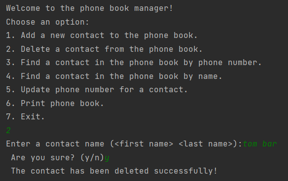

# PhoneBook-Manager

## Overview

The Phone Book Manager is a simple C program that allows users to manage a phone book using a linked list. 
It supports adding, deleting, searching, and updating contacts, and displays the phone book in alphabetical order based on the first letter of the last name.

## Screenshots





## Features

- **Add a contact**: Allows users to add new contacts with first name, last name, and phone number.
- **Delete a contact**: Removes a contact by their first and last name.
- **Search by phone number**: Finds a contact by their phone number.
- **Search by name**: Finds a contact by their first and last name.
- **Update phone number**: Updates the phone number of an existing contact.
- **Print phone book**: Displays all contacts in the phone book.
- **Exit and free memory**: Safely exits the program and frees all allocated memory.

## Project Structure

- **Linked List**: 
  - Contacts are stored as a linked list and managed through a phone book array of size 26 (one for each letter of the alphabet).


## Contact Struct

Each contact is represented by a `contact` structure, which contains the following fields:

- **firstName** (char*): First name of the contact.
- **lastName** (char*): Last name of the contact.
- **phoneNum** (char*): Phone number of the contact.
- **next** (contact*): Pointer to the next contact in the linked list.

## Memory Management

The program dynamically allocates memory for each contact using `malloc`. Upon exiting the program, all memory is freed using the `freeAll()` function to avoid memory leaks.

## How to Compile and Run

1. Clone the repository:
   ```bash
   git clone https://github.com/HodayaBarak/phonebook-manager.git

2. Navigate to the project directory:
    ```bash
    cd phonebook-manager

3. Compile the code:
   ```bash
   gcc phonebook.c -o phonebook
    
4. Run the program:
  ```bash
  ./phonebook


   
